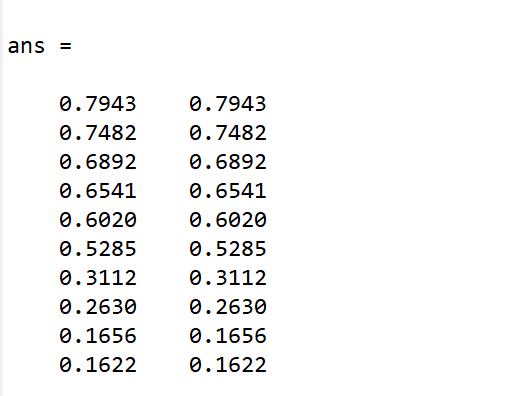
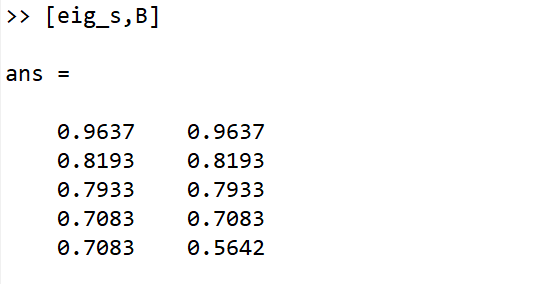
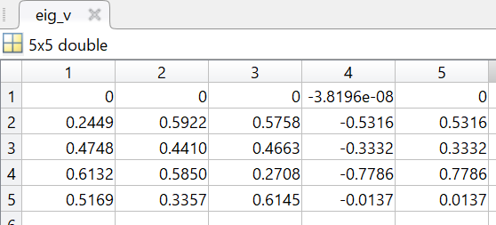
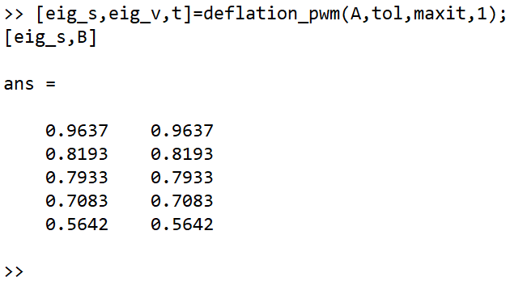
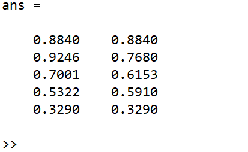
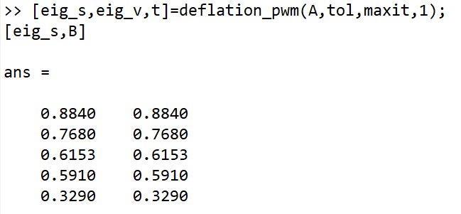
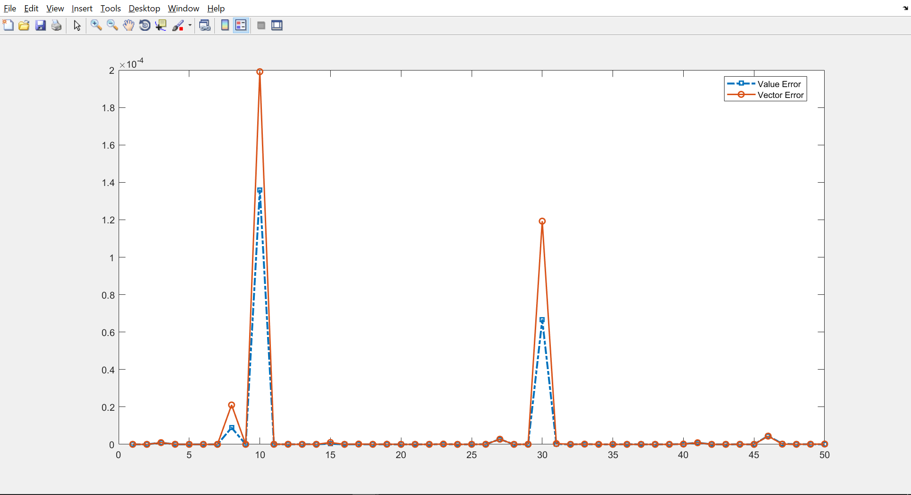
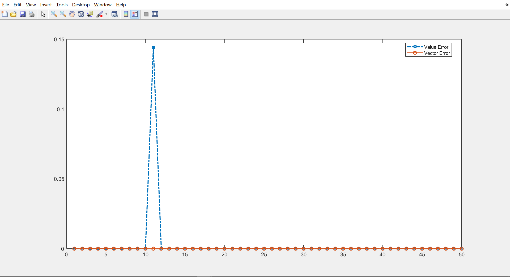
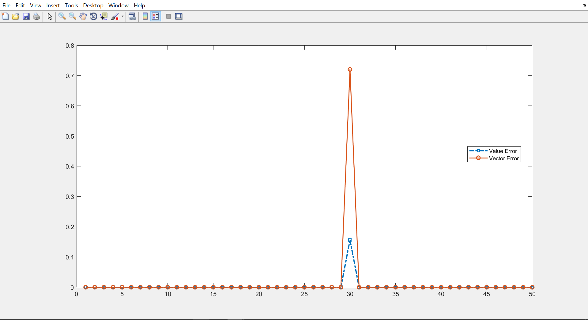

Power Method
============

The author is JingMatrix.

摘要：这篇报告对幂法的几种形式予以实现，并简要地讨论了在试验过程中遇到的特殊情景。

narrow sense power method
-------------------------

通过函数sub\_powmeth.m函数进行实现：
```matlab
function [x,lambda]=sub_powmeth(A,x0,tol,maxit)
%该函数用于实现狭义的幂法，与反幂法相对
x=x0;
z=x/norm(x,inf);
x=A*z;
lambda=z'*A*z/(z'*z);
for k=(1:maxit)
    z=x/norm(x,inf);
    x=A*z;
    tmp=lambda;
    lambda=z'*A*z/(z'*z);
        break;
    end
end
end
```
inverse power method
--------------------

通过函数inv\_powmeth.m函数进行实现：
```matlab
function [x,lambda]=inv_powmeth(A,x0,tol,maxit)
%inverse power method
x=x0;
z=x/norm(x,inf);
[L,U,P]=lu(A);
x=tri_slv(L,U,P*z);
lambda=z'*A*z/(z'*z);
for k=(1:maxit)
    z=x/norm(x,inf);
    x=tri_slv(L,U,P*z);
    tmp=lambda;
    lambda=z'*A*z/(z'*z);
    if abs(lambda-tmp)<tol*lambda
        break;
    end
end
end
```
power method for all eigenvalues
--------------------------------

通过函数powmeth.m函数进行实现：
```matlab
function [eig_s,eig_v]=powmeth(A,tol,maxit)
% power method
% It is easy to understand
% 该函数可以决定是否调用反幂法
% 该函数可以正确输出特征值，但是对特征向量未作
% 处理，输出的值只是中间量，价值不大
k=length(A);
eig_s=zeros(k,1);
eig_v=zeros(k,k);
for i=(k:-1:1)
    x0=rand(i,1);
    [eig_v(k-i+1:k,k-i+1),eig_s(k-i+1)]=inv_powmeth(A,x0,tol,maxit);
    e=zeros(i,1);
    e(1,1)=1;
   eig_v(k-i+1:k,k-i+1)=eig_v(k-i+1:k,k-i+1)/norm(eig_v(k-i+1:k,k-i+1),2);
    w=eig_v(k-i+1:k,k-i+1)-e;
    c=norm(w);
    if c==0 %Whether rank(A) is 1;
        break;
    else
        w=w/c;
        P=eye(i)-2*(w*w');
        T=P*A*P';
        A=T(2:i,2:i);
    end
end
end
```
deflation in power method
-------------------------

通过函数deflation\_pwm.m函数进行实现：
```matlab
function [eig_s,eig_v,t]=deflation_pwm(A,tol,maxit,flag)
% This function implements the deflation power method in
% find eigen system for matrix A.
% Input:
% A - the matrix to find eigen system
% tol - the tolerable error in difference comparing in the
%   power method
% maxit - the max iteration in each power method step
%   flag - whether generate the eigenvector errors figure
% 1 for yes, 0 for no, 2 for simple information
% Output:
% eig_s - the eigenvalues of A
% eig_v - the eigenvectors of A
% t - parameter the indicate the error in eig_v
k=length(A);
% A的大小
mc=cell(k,3);
% mc is a data structure
% mc:第一列用于存放每一次降阶的矩阵；第二列用于
% 存放对应矩阵的特征向量非零元素的位置p；第三列
% 用于存放需要记载下来的该矩阵第p行元素；
mc{1,1}=A;
% 初始化计算矩阵A
eig_s=zeros(k,1);
eig_v=zeros(k,k);
eig_v_temp=eig_v;
% 初始化用于存放数据的变量
ind=1;
P=zeros((k-1)*k/2,1);
% ind与P用于误差统计，其长度是由所有回代的总步
%数决定的为1到k-1求和
t=0;
% 特征向量误差的初值
for i=(1:k)
    [eig_v_temp(i:k,i),eig_s(i)]=sub_powmeth(mc{i,1}...
        ,rand(k-i+1,1),tol,maxit);
    mc{i,2}=f_non_zero(eig_v_temp(i:k,i),1e-4);
    eig_v_temp(i:i-2+mc{i,2},i)=0;
    mc{i,3}=mc{i,1}(mc{i,2},:);
	% 计算第i个数据节点
    eig_v(:,i)=eig_v_temp(:,i);
	% 开始进入特征向量的回代过程
    if i> 1
        for j=(i:-1:2)
            eig_v(j-1:k,i)=de_shift(eig_s(i),eig_s(j-1),ind_m(mc{j-1,2},...
                eig_v(j:k,i)),eig_v_temp(j-1:k,j-1),mc{j-1,3},mc{j-1,2});
            eig_v(1:k,i)=eig_v(1:k,i)/norm(eig_v(1:k,i),inf);
			% 回代一次
            P(ind)=norm((mc{j-1,1}-eig_s(i)*eye(k-j+2))...
                *eig_v(j-1:k,i),inf);
            ind=ind+1;
			% 计算这一次回代后的特征向量的准确性
        end
    end
    if i==k
        break;
		%判断是否跳出，不保存冗余数据
    else
        mc{i+1,1}=de_part(mc{i,1}-eig_v_temp(i:k,i)*mc{i,3}...
            /eig_v_temp(mc{i,2}+i-1,i),mc{i,2});
    end
end
if flag==1
    %根据参数，决定画图
    figure
    plot(P','LineStyle','-.','LineWidth',2,...
        'Color','red','Marker','o','MarkerFaceColor','yellow','MarkerSize',3)
    %     ylim([0,1e-4])
elseif flag==2
    t=max(P);
	% flag为2不画图时，输出误差图中的最大值
end
end
function [v]=de_shift(lambda,lambda0,u,u0,x,p)
%用于回代到上一个矩阵的特征向量
v=(lambda-lambda0)*u+(x*u)/u0(p)*u0;
end
function B=de_part(A,p)
%用于处理特征向量的零元素问题
n=length(A);
if (p>n || p<=0)
    error('The index is not proper')
elseif p==1
    B=A(2:n,2:n);
elseif p==n
    B=A(1:n-1,1:n-1);
else
    B=[A(1:p-1,1:p-1),A(1:p-1,p+1:n);
        A(p+1:n,1:p-1),A(p+1:n,p+1:n)];
end
end
function inc=ind_m(p,v)
n=length(v);
if p==1
    inc=[0;v];
elseif p==n+1
    inc=[v;0];
else
    inc=[v(1:p-1);0;v(p:n)];
end
end
function p=f_non_zero(v,zero_ctr)
p=1;
%用于控制零元素的判断方法
for i=(1:length(v))
    if abs(v(i))<zero_ctr
        p=p+1;
    end
    if p>length(v)
        error('Error in Non_zero function')
    end
end
end
```
error analyses in deflation
----------------------------

### 简单测试

首先通过运行一个简单的脚本验证算法的正确性：

编写脚本powmeth\_test\_ordinary.m如下：
```matlab
%A Simple Test for Deflation method
clc;
clear;
k=10;
tol=1e-9;
maxit=1e4;
D=rand(k,k);
% D(1,1:4)=0;
B=sort(rand(k,1),'descend');
A=D*diag(B)*inv(D);
[eig_s,eig_v,t]=deflation_pwm(A,tol,maxit,1);
[eig_s,B]
```
命令行输出结果如下图所示：



生成的图形在尾注[1]，关于图形的解释，已经在程序中给出，不再重复。

### 复杂测试

下面通过一定次数的重复实验，来找出一些特殊的数据，所谓特殊，即使得算法会与实际结果有出入。利用循环来进行控制，控制的脚本为powmeth\_test.m。
```matlab
%较为复杂的测试，可以实现找出特殊值的目的
clc;
clear;
k=5;
tol=1e-9;
maxit=1e4;
test_t=50;
%控制单次运行所测试的矩阵个数
error_s=zeros(test_t,1);
error_v=zeros(test_t,1);
flag=0;
%控制是否输出结果图，该测试中，有异常才会输出
for j=(1:test_t)
    D=rand(k,k);
    D(1,1:4)=0;
    B=sort(rand(k,1),'descend');
    A=D*diag(B)*inv(D);
    [eig_s,eig_v,error_v(j)]=deflation_pwm(A,tol,maxit,2);
    error_s(j)=norm(B-eig_s,inf);
    if (error_v(j)>0.1 || error_s(j)>0.1)
	%当误差明显时候，终止测试，保存异常数据，输
	%出图像
        flag=1;
        break;
    end
end
if flag==1
	%绘图参数控制部分
    figure;
    p=plot([error_s,error_v]);
    % ylim([0,1e-1])
    p(1).LineStyle='-.';
    p(2).LineStyle='-';
    p(1).LineWidth = 2;    p(2).LineWidth = 1.5;
    p(1).Marker = 's';
    p(2).Marker = 'o';
    legend('Value Error','Vector Error','Location','best')
end
% [eig_s,B]
```
由于程序设计为不出错视不画图，这里先暂时修改设定，输出一副结果图，见尾注[2]。

下面回到程序，进行足够多次的试验，可以找到一两次偏差的情景，下面对其中两个典型进行分析。

#### 分析结果1

第一种错误出现时所形成的图像见尾注[3]

从图像中我们可以知道错误发生在第10次循环过程中，而且是特征值发生较大的偏差。

进入命令行调出特征值计算结果，右边为正确值，左边为计算值。



如前所说，是特征值的计算错误，查看对应的特征向量计算结果可以找出原因，计算的特征向量如图：



即特征向量算法中判断元素是否为零的阈值过小，修改这一阈值为1e-4，即修改deflation.m中一段代码为：
```matlab
[eig_v_temp(i:k,i),eig_s(i)]=sub_powmeth(mc{i,1}...
        ,rand(k-i+1,1),tol,maxit);
    mc{i,2}=f_non_zero(eig_v_temp(i:k,i),1e-4);
    eig_v_temp(i:i-2+mc{i,2},i)=0;
    mc{i,3}=mc{i,1}(mc{i,2},:);
eig_v(:,i)=eig_v_temp(:,i);
```
再次使用原数据计算，得出正确结果：



至此，分析完毕。

#### 分析结果2

下面开始讨论遇到的第二种情景，出现错误时，画出的图形见尾注[4]。

从图中可以知道，这时候特征值与特征向量都出现偏差，下面给出计算的特征值与实际值的比较：



可以看到其中的三个特征值均出现了计算偏差，但是两个端点是正确的（这点也许很有趣？）。通过检查矩阵的实际特征向量可以知道原因：


实际特征向量有过小的值，这时候，我们只需要将前面提及的阈值改回到1e-7即可解决问题。改正之后的计算结果为：



至此，分析完毕。

### 总结

矩阵的随机生成会给算法带来一定程度的冲击，通过检查特征向量（计算值以及实际值）有利于我们分析找出出现偏差的原因。

这一页开始显示所有的尾注附图。

[1] 

[2] 

[3] 

[4] 
